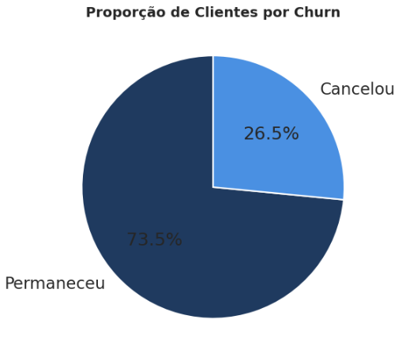
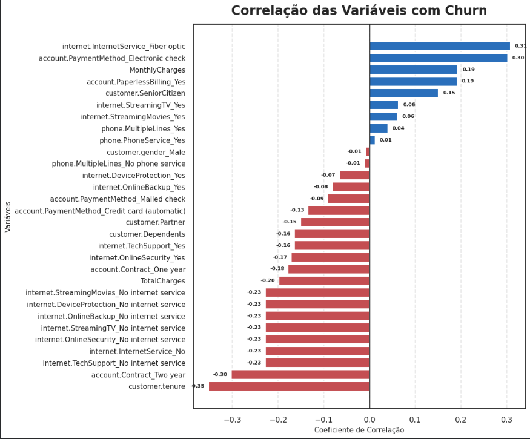
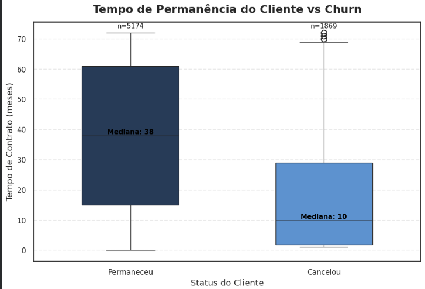
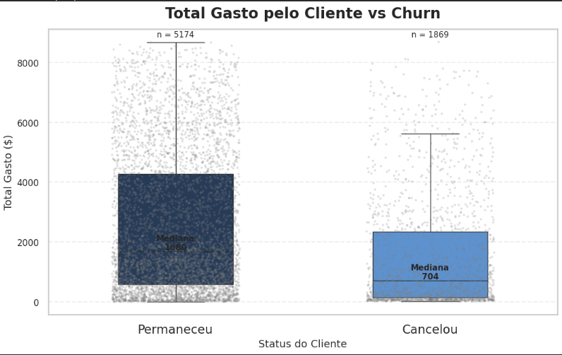
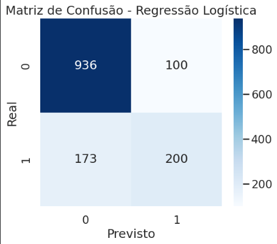
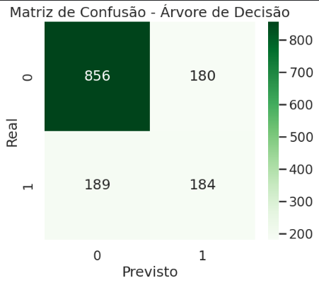

# 📊 Análise e Previsão de Evasão de Clientes (Churn)

Projeto de **Machine Learning** voltado para a análise e previsão de **evasão de clientes (churn)** em uma empresa de telecomunicações.

O objetivo principal é **identificar padrões de comportamento associados ao cancelamento de clientes** e construir **modelos preditivos capazes de estimar a probabilidade de churn**, permitindo que a empresa implemente estratégias de retenção mais eficientes.

A redução do churn é um desafio estratégico para empresas de telecomunicações, pois **reter clientes costuma ser mais barato do que adquirir novos**.

---

# 📌 Objetivos do Projeto

- 📊 Realizar **Análise Exploratória de Dados (EDA)**
- 🤖 Construir **modelos de Machine Learning para prever churn**
- 🔎 Identificar **variáveis mais importantes para a evasão**
- 📉 Avaliar modelos com métricas de classificação
- 💡 Propor **estratégias de retenção de clientes**

---

# 📂 Estrutura do Projeto

```
customer-churn-ml/
│
├── data/
│ └── telecom_tratado.csv
│
├── notebooks/
│ └── churn_analysis.ipynb
│
├── images/
│ ├── churn_distribution.png
│ ├── correlation_churn.png
│ ├── tenure_vs_churn.png
│ ├── totalcharges_vs_churn.png
│ ├── confusion_matrix_logistic.png
│ ├── confusion_matrix_tree.png
│ ├── logistic_coefficients.png
│ └── tree_feature_importance.png
│
└── README.md
```

### Descrição das pastas

**data/**  
Contém os dados já tratados utilizados na modelagem.

**notebooks/**  
Notebook principal contendo toda a análise exploratória, preparação dos dados e treinamento dos modelos.

**images/**  
Pasta com gráficos e visualizações geradas durante a análise.

---

# 🔧 Preparação dos Dados

Antes da modelagem, foi realizado um processo de preparação dos dados para garantir qualidade e consistência das análises.

## Classificação das Variáveis

As variáveis foram separadas em dois grupos:

### Variáveis Categóricas

- Gender
- Partner
- Dependents
- PhoneService
- MultipleLines
- InternetService
- OnlineSecurity
- OnlineBackup
- DeviceProtection
- TechSupport
- StreamingTV
- StreamingMovies
- Contract
- PaperlessBilling
- PaymentMethod

### Variáveis Numéricas

- Tenure
- MonthlyCharges
- TotalCharges

---

## Codificação das Variáveis

As variáveis categóricas foram convertidas para formato numérico utilizando **One-Hot Encoding**, permitindo que os modelos de Machine Learning possam processá-las corretamente.

---

## Normalização dos Dados

Para o modelo de **Regressão Logística**, as variáveis numéricas foram normalizadas utilizando **StandardScaler**, garantindo que todas possuam a mesma escala e evitando que variáveis com valores maiores influenciem excessivamente o modelo.

A **Árvore de Decisão** não exige normalização, pois seu funcionamento é baseado em divisões hierárquicas dos dados.

---

## Divisão dos Dados

Os dados foram divididos em:

- **80% para treinamento**
- **20% para teste**

Utilizando a função `train_test_split` da biblioteca **Scikit-Learn**, garantindo uma avaliação adequada do desempenho dos modelos em dados não vistos.

---

# 📊 Análise Exploratória de Dados (EDA)

A análise exploratória foi realizada para entender padrões e relações entre as variáveis e o churn.

---

## 📉 Distribuição de Churn

Mostra a proporção de clientes que permaneceram e os que cancelaram o serviço.



---

## 🔎 Correlação das Variáveis com Churn

Permite identificar quais variáveis possuem maior relação com a evasão de clientes.



---

## ⏳ Tempo de Permanência vs Churn

Clientes com **menor tempo de contrato (tenure)** tendem a apresentar maior probabilidade de cancelamento.



---

## 💰 Total Gasto vs Churn

Clientes que cancelam o serviço geralmente apresentam **menor gasto acumulado** ao longo do tempo.



---

# 🤖 Modelos de Machine Learning

Foram utilizados dois modelos principais para previsão de churn.

---

## 📈 Regressão Logística

Modelo linear amplamente utilizado para **classificação binária**.

### Justificativa de uso

- Serve como **modelo baseline**
- Alta **interpretabilidade**
- Permite analisar a **influência de cada variável**

### Características

- Requer normalização das variáveis
- Modelo simples e eficiente
- Fácil interpretação dos coeficientes

---

## 🌳 Árvore de Decisão

Modelo baseado em regras que divide os dados em diferentes ramos para classificar clientes.

### Justificativa de uso

- Captura **relações não lineares**
- Permite identificar **regras de decisão**
- Facilita interpretação dos fatores de churn

### Características

- Não requer normalização
- Estrutura hierárquica
- Fácil visualização da importância das variáveis

---

# 📊 Avaliação dos Modelos

Os modelos foram avaliados utilizando métricas clássicas de classificação:

- **Accuracy**
- **Precision**
- **Recall**
- **F1-score**
- **Confusion Matrix**

---

## Logistic Regression



---

## Decision Tree



---

# 🔍 Importância das Variáveis

A análise de importância das variáveis permite identificar quais fatores têm maior impacto na previsão de churn.

---

## Coeficientes da Regressão Logística

Mostram a influência de cada variável no modelo.


---

## Importância das Variáveis na Árvore de Decisão

Indica quais variáveis foram mais relevantes nas decisões do modelo.


---

# 🚨 Principais Fatores que Influenciam o Churn

A análise identificou alguns fatores críticos para a evasão de clientes:

- ⏳ **Baixo tempo de contrato**
- 💰 **Menor gasto total**
- 📉 **Mensalidades mais altas**
- 📄 **Contratos de curto prazo**

Esses resultados indicam que clientes com **menor vínculo com a empresa** apresentam maior probabilidade de cancelar o serviço.

---

# 💡 Estratégias de Retenção

Com base nos resultados obtidos, algumas estratégias podem ajudar a reduzir o churn:

- 🎁 Programas de fidelização
- 📉 Descontos para contratos de longo prazo
- 🎯 Ofertas personalizadas para clientes com alto risco de cancelamento
- ⭐ Melhoria na experiência do cliente

---

# 🧠 Tecnologias Utilizadas

- Python
- Pandas
- NumPy
- Matplotlib
- Seaborn
- Scikit-Learn
- Google Colab

---

# ▶️ Como Executar o Projeto

### 1️⃣ Clonar o repositório

```bash
git clone https://github.com/seu-usuario/customer-churn-ml.git
```

2️⃣ Instalar as dependências
```
pip install pandas numpy matplotlib seaborn scikit-learn
```

3️⃣ Abrir o notebook

Abra o notebook principal:
```
notebooks/churn_analysis.ipynb
```

Você pode executá-lo em:

Jupyter Notebook

Google Colab

VS Code

📈 Possíveis Melhorias Futuras

Implementar modelos mais avançados:

Random Forest

XGBoost

Gradient Boosting

Aplicar Cross Validation

Otimizar hiperparâmetros

Construir dashboard interativo

Implantar modelo em API de previsão

👨‍💻 Autor

Projeto desenvolvido para fins de estudo e prática de Machine Learning aplicado à previsão de churn de clientes.
